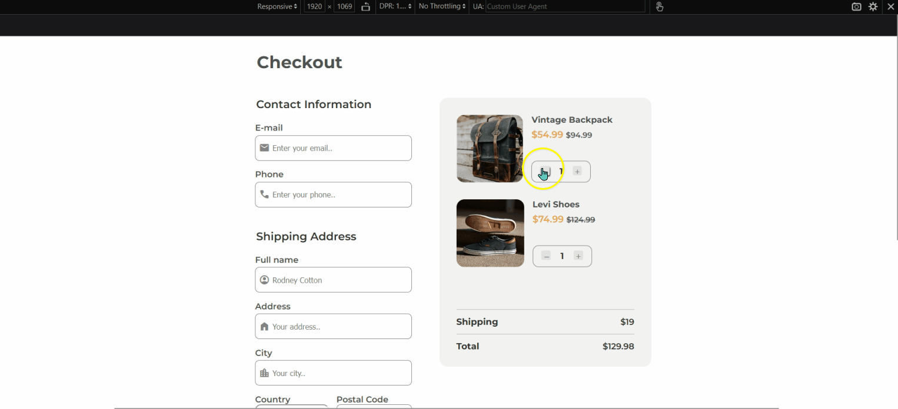
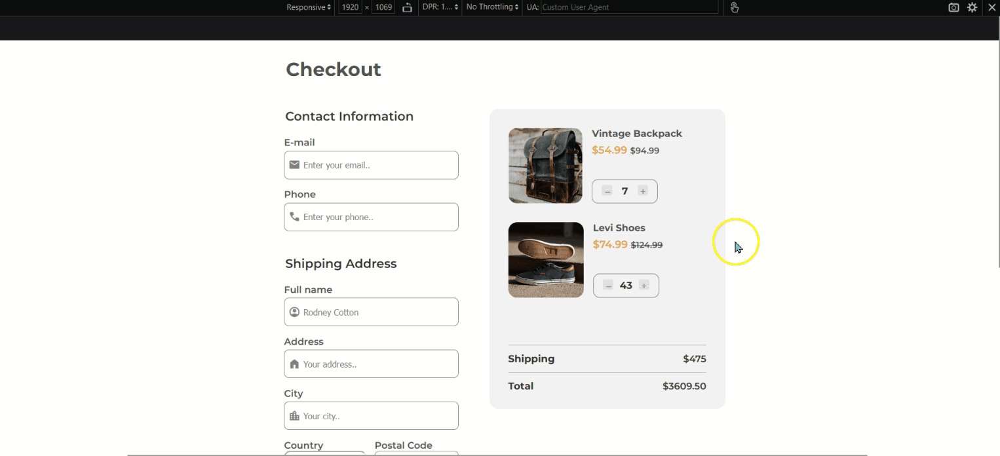

<!-- Please update valmy-gallery-dev-ioue in the {}  -->

<h1 align="center">Checkout Page</h1>

<div align="center">
   Solution for a challenge from  <a href="http://devchallenges.io" target="_blank">Devchallenges.io</a>.
</div>

<div align="center">
  <h3>
    <a href="https://devchallenges.io/solutions/OEirVCXdynHGEqKTVJO7">
      Demo
    </a>
    <span> | </span>
    <a href="https://checkout-page-chris-chamberlain-devio.netlify.app/">
      Site
    </a>
    <span> | </span>
    <a href="https://devchallenges.io/challenges/0J1NxxGhOUYVqihwegfO">
      Challenge
    </a>
  </h3>
</div>

<!-- TABLE OF CONTENTS -->

## Table of Contents

- [Overview](#overview)
  - [Built With](#built-with)
- [Features](#features)
- [Contact](#contact)

<!-- OVERVIEW -->

## Overview

### Fully Responsive UI


### Empty Basket Message


### Free Shipping Message



- Go to live [site](https://checkout-page-chris-chamberlain-devio.netlify.app/)
- See the demo [here](https://devchallenges.io/solutions/OEirVCXdynHGEqKTVJO7)
- I'm not super familiar with forms, so there was a lot to review and learn when it came to implementing the contact and shipping info form - with both HTML elements and structure, as well as styling. 
- I didn't want to just hard-code the values in the cart and leave it at that; I wanted to make it functional and realistic. I wanted to include add item, remove item, calculate total and shipping, conditional free shipping (shipping >= $500), and an empty basket notification. I found the JavaScript the most challenging, but also the most interesting and rewarding as when I successfully implemented a feature, I was able to use it and interact with it in the UI.
- I made the products dynamic by storing my products in an array of objects which I then iterated over and dynamically inserted into an HTML template string. This way, the user can add or remove products to / from the cart.
- I used the filter array method to remove items from the cart.
- I conditionally rendered two different HTML template strings based on the shipping cost. If shipping is >= $500, then the UI updates to render the message that the user qualifies for free shipping.

### Built With

<!-- This section should list any major frameworks that you built your project using. Here are a few examples.-->

- HTML
- SCSS
- JavaScript


## Features

<!-- List the features of your application or follow the template. Don't share the figma file here :) -->

I developed this checkout pagte as a submission to a [DevChallenges](https://devchallenges.io/challenges) challenge. The [challenge](https://devchallenges.io/challenges/0J1NxxGhOUYVqihwegfO) was to build an application to complete the given user stories and replicate the provided Figma design.


## How To Use

To clone and run this application, you'll need [Git](https://git-scm.com) and [Node.js](https://nodejs.org/en/download/) (which comes with [npm](http://npmjs.com)) installed on your computer. From your command line:

```bash
# Clone this repository
$ git clone https://github.com/AkaraTawng/my-gallery-dev-io.git

# Install dependencies
$ npm install

# Run the app
$ npm start
```
## Contact

- [Website](https://christopher-chamberlain.netlify.app/)
- [GitHub](https://github.com/AkaraTawng)
- [Twitter](https://twitter.com/chris_tawan)
- [LinkedIn](https://www.linkedin.com/in/christopher-chamberlain-023507205/)

